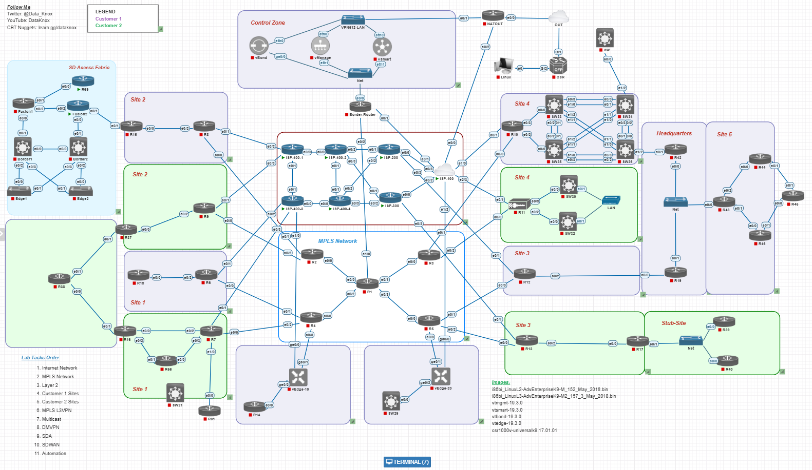

# CCIE Lab

## Lab Overview
This repository documents my journey through Knox Hutchinson's comprehensive CCIE lab topology. The lab covers enterprise-level networking technologies and represents a realistic service provider network with multiple customer sites.

## Topology
The lab consists of several key components:
- **Internet Network**: Multiple ISPs (ASN 100, 200, 300, 400) with complex BGP relationships
- **MPLS Core**: Service provider backbone with L3VPN and L2VPN services  
- **Customer Sites**: Multiple customer networks with various connectivity requirements
- **Control Zone**: Management and automation components

## Lab Sections
This comprehensive lab covers modern enterprise and service provider technologies across 11 major sections:

1. **Internet Network**: Multi-ASN BGP with confederations, route filtering, and traffic engineering
2. **MPLS Network**: Core MPLS implementation and label switching
3. **Layer 2**: Switching technologies, VLANs, and Layer 2 services
4. **Customer 1 Sites**: First customer network implementation and connectivity
5. **Customer 2 Sites**: Second customer network with different requirements
6. **MPLS L3VPN**: Layer 3 VPN services over MPLS backbone
7. **Multicast**: Multicast routing and MPLS multicast VPN
8. **DMVPN**: Dynamic Multipoint VPN implementation
9. **SDA**: Software-Defined Access with DNA Center
10. **SD-WAN**: Software-Defined WAN with vManage orchestration
11. **Automation**: Network automation using Python, Ansible, and APIs
