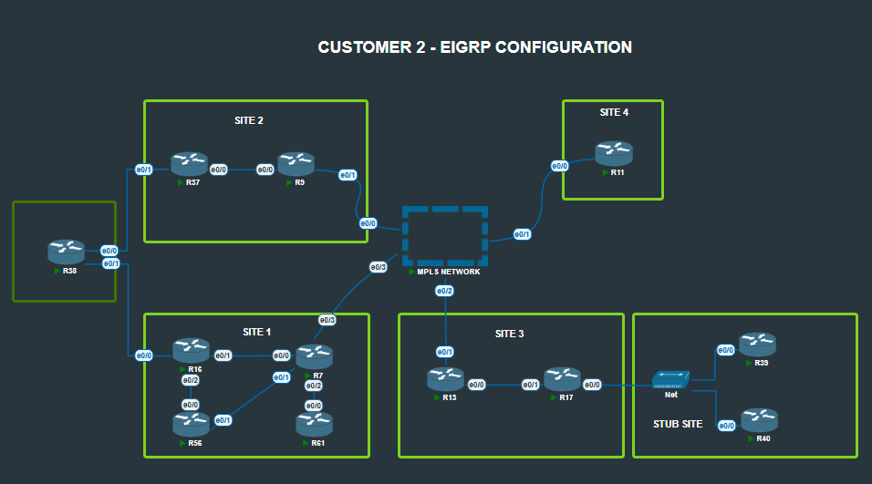

# Customer 2 Sites - EIGRP

## Overview
Configured EIGRP Named Mode across multiple Customer 2 sites with advanced routing features including traffic engineering, fast convergence, loop-free alternatives, route summarization, and stub configurations. Implemented both EIGRP Named Mode (ASN 50) and Classic Mode (ASN 20) depending on site requirements.



## Tasks

### Customer 2 Site 1 - EIGRP Named Mode ASN 50
1. EIGRP Named Mode configuration for ASN 50
2. WAN interface exclusion from EIGRP process

### Dark Green Box Site - EIGRP Named Mode ASN 50
3. EIGRP Named Mode implementation for ASN 50

### Customer 2 Site 2 - EIGRP Named Mode ASN 50  
4. EIGRP Named Mode configuration for ASN 50
5. WAN interface exclusion from EIGRP process
6. Traffic engineering: R7 prefers R56 for outbound traffic
7. Fast convergence with loop-free alternative (R16 as backup for R7)
8. Path preference: R7 uses R16 to reach R38's loopback
9. Route summarization: R37 summarizes R37/R38 loopbacks to R9
10. Leak specific route: R9 receives full prefix for R38's loopback

### Customer 2 Site 3 - EIGRP Classic Mode ASN 20
11. EIGRP ASN 20 configuration across all site routers
12. Default route advertisement from R13 to R17
13. EIGRP stub configuration on R17
14. Default route propagation to downstream routers
15. End-to-end connectivity verification (downstream to R13's loopback)

## Configuration Examples

### EIGRP Named Mode Configuration

#### Basic Named Mode Setup (Sites 1 & 2)
```cisco
! Router Configuration - Customer 2 Site 1/2
router eigrp CCIE
 address-family ipv4 unicast autonomous-system 50
  topology base
   no auto-summary
  exit-af-topology
  network 10.0.22.0 0.0.0.255
  network 9.9.9.9 0.0.0.0
  exit-af-interface
 exit-address-family
```

#### Traffic Engineering and Fast Convergence (R7)
```cisco
! R7 - Traffic Engineering and Loop-Free Alternative
router eigrp CCIE
 address-family ipv4 unicast autonomous-system 50
  topology base
   variance 2
  exit-af-topology
  
  ! Interface to R56 - Preferred path
  af-interface e0/0
   bandwidth 100000
   delay 100
  exit-af-interface
  
  ! Interface to R16 - Backup path with FRR
  af-interface e0/2 
   bandwidth 10000
   delay 1000
  exit-af-interface
  
  ! Fast Reroute configuration
  topology base
   fast-reroute per-prefix all
   fast-reroute load-sharing disable
  exit-af-topology
 exit-address-family
  
```
#### Route Summarization with Leak (R37)
```cisco
! R37 - Summarization with specific route leak
router eigrp CUSTOMER2_ASN50
 address-family ipv4 unicast autonomous-system 50
  topology base
   summary-address 32.0.0.0/5 leak-map LEAK_R38
  exit-af-topology
 exit-address-family

! Leak map to allow R38's specific loopback
ip access-list extended R38_SPECIFIC
 permit ip any host 38.38.38.38

route-map LEAK_R38 permit 10
 match ip address R38_SPECIFIC
```

## Design Principles

### EIGRP Named Mode vs Classic Mode
Named Mode provides enhanced features and configuration flexibility compared to Classic Mode. The choice depends on feature requirements:
- **Named Mode** offers advanced features like per-interface configuration, improved authentication, and better IPv6 integration
- **Classic Mode** maintains backward compatibility and simpler configuration for basic deployments

### WAN Interface Exclusion Strategy
Passive interfaces on WAN connections prevent:
- Unnecessary EIGRP Hello packets over expensive WAN links
- Potential routing loops with service provider networks
- Exposure of internal routing information to external networks

### Traffic Engineering with Metrics
EIGRP's composite metric (bandwidth, delay, reliability, load, MTU) allows granular traffic engineering:
- **Bandwidth manipulation** influences path selection based on link capacity
- **Delay adjustment** fine-tunes path preference for latency-sensitive traffic
- **Variance** enables unequal-cost load balancing when needed

### Fast Reroute (Loop-Free Alternative)
Pre-computed backup paths provide:
- **Sub-second convergence** during primary path failures
- **Loop prevention** through feasibility condition validation
- **Bandwidth efficiency** by avoiding convergence-related flooding

### Route Summarization with Selective Leaking
Summary routes reduce routing table size while leak maps provide exceptions:
- **Scalability** through reduced routing table entries
- **Flexibility** to advertise specific routes when needed
- **Policy control** over route advertisement granularity

### EIGRP Stub Configuration Benefits
Stub routers optimize network behavior:
- **Convergence improvement** by eliminating query scope
- **Bandwidth conservation** through reduced EIGRP traffic
- **Network stability** by preventing transit routing through stub sites

## Verification Commands Used

```cisco
! EIGRP Named Mode Verification
show eigrp address-family ipv4 neighbors
show eigrp address-family ipv4 topology
show eigrp address-family ipv4 interfaces
show eigrp address-family ipv4 traffic

! Fast Reroute Verification
show eigrp address-family ipv4 topology frr
show ip route eigrp
show ip cef [network] detail

! Classic Mode Verification  
show ip eigrp neighbors
show ip eigrp topology
show ip eigrp interfaces
show ip route eigrp

! Stub Configuration Verification
show ip eigrp neighbors detail
show ip protocols
debug eigrp packets query

! Traffic Engineering Verification
show ip route [network]
traceroute [destination] source [loopback]
show ip eigrp topology [network]
```

## Network Behavior Analysis

### Convergence Optimization
- Fast Reroute reduces convergence time from seconds to milliseconds
- Stub configuration eliminates unnecessary query propagation
- Proper summarization reduces SPF calculation complexity

### Path Selection Logic
- Primary paths through R56 for normal traffic flow
- Backup paths through R16 activated during failures
- Specific routing for R38's loopback demonstrates granular control

### Route Advertisement Control
- Summary routes provide scalability benefits
- Leaked routes maintain connectivity for specific requirements
- Default route propagation ensures Internet connectivity
