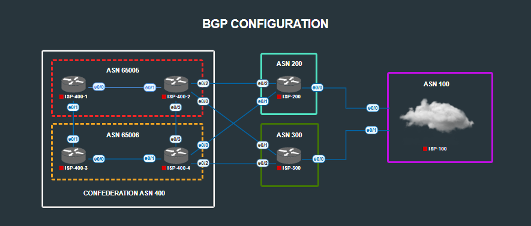

# Internet Network - BGP Configuration

## Overview
Configured complex BGP relationships across multiple autonomous systems with advanced features including confederations, route filtering, traffic engineering, and authentication.



## Requirements Completed

### Basic BGP Setup
- SP-100: ASN 100
- SP-200: ASN 200  
- SP-300: ASN 300
- ISP-400: ASN 400 (with confederation)

### BGP Confederation Configuration
- ISP-400-1 & ISP-400-2: Sub-AS 65005 with authentication "CISCO"
- ISP-400-3 & ISP-400-4: Sub-AS 65006 with authentication "CISCO1"

### Tasks
1. eBGP relationships between directly connected neighbors in different ASNs
2. ISP-300 neighbor verification (single-hop TTL security)
3. Loopback advertisements into BGP
4. Customer route advertisements with proper origination
5. ISP-400-1 loopback filtering (not advertised outside ASN 400)
6. ISP-300 selective advertisement (only loopback to ISP-400-4)
7. ISP-400-4 route filtering (ISP-300's loopback stays within local ASN)
8. ISP-100 default route propagation
9. Route summarization (ASN 200/300 summarizing ASN 400 loopbacks to ASN 100)
10. Traffic engineering (ASN 400 ingress via ISP-400-4)
11. Specific routing (ISP-400-2's loopback via ISP-300)
12. BGP soft reset procedures

## Configuration Examples

### BGP Confederation
```cisco
ISP-400-1 (Sub-AS 65005)
router bgp 65005
 bgp confederation identifier 400
 bgp confederation peers 65006 
 neighbor 142.142.142.142 remote-as 65005
 neighbor 142.142.142.142 password CISCO
 neighbor 142.142.142.142 update-source Loopback0
```

### TTL Security
```cisco
router bgp 300
 neighbor 172.30.103.100 ttl-security hops 1
```

### Route Summarization
```cisco
ASN 200/300 summarizing ASN 400 routes
router bgp [200|300]
 aggregate-address 128.0.0.0 224.0.0.0 summary-only
```

### Route Filtering
```cisco
Preventing ISP-400-1 loopback from being advertised externally
neighbor 143.143.143.143 route-map LOOP-COMM out
```

## Implementation Notes

### Confederation Design
- Established peerings between sub-ASNs (65005 and 65006) to scale ASN 400  
- Verified authentication across confederation boundaries 
- Differentiated between the confederation identifier (400) and sub-AS numbers  
- Confirmed that external ASNs only see ASN 400, maintaining a clean external topology view  
- Ensured loopback reachability across the confederation using update-source and proper IGP support  

### Route Policy Control
- Applied selective advertisement policies to simulate realistic ISP filtering  
- Balanced route filtering with the need to maintain end-to-end reachability  
- Used BGP attributes (AS-path prepending, local preference, MED) for traffic engineering and path control  
- Summarized loopbacks from ASN 400 into ASN 200/300 for scalability and reduced table size  
- Prevented specific routes (like ISP-400-1 loopback) from leaving the local AS for policy compliance  

### Operational Practices
- Leveraged BGP soft reset to apply new policies without dropping sessions  
- Validated sessions with show ip bgp confederation to ensure proper hierarchy  
- Used prefix-lists and route-maps for granular filtering instead of broad ACLs  
- Incorporated TTL security to mitigate spoofing and protect eBGP sessions  
- Structured configuration with clear comments for easier troubleshooting and review  

## Verification Commands

```cisco
! BGP Status and Neighbors
show ip bgp summary
show ip bgp neighbors 172.30.103.100
show ip bgp confederation

! Route Information  
show ip bgp
show ip bgp 141.141.141.141
show ip route bgp

! Troubleshooting
debug ip bgp updates
clear ip bgp * soft out
clear ip bgp 172.30.103.100 soft out
ping 100.100.100.100 source loopback0
```

## Design Principles

1. **Confederation Benefits**: Solves iBGP full-mesh scaling issues while maintaining external AS appearance
2. **Route Filtering Precision**: Prefix-lists and route-maps provide granular control over advertisements
3. **Traffic Engineering**: Multiple techniques (AS-path prepending, local preference, MED) can influence path selection
4. **Authentication Importance**: BGP passwords prevent unauthorized peering relationships
5. **Soft Reset Value**: Allows policy changes without disrupting established sessions
