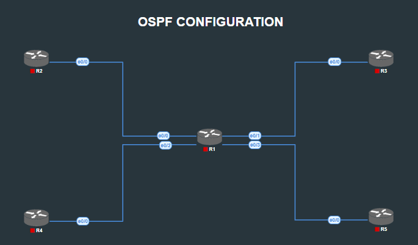

# MPLS Network - OSPF and MPLS Configuration



## Overview
Configured OSPF Area 12.34.5.0 as the IGP foundation for the MPLS network, implementing advanced OSPF features including authentication, BFD, and OSPFv3. Enabled MPLS across all core routers to prepare for L3VPN services.

### OSPF Configuration
1. OSPF Area 12.34.5.0 between all MPLS routers (R1, R2, R3, R4, R5)
2. OSPF cost calculation optimized for Gigabit Ethernet interfaces
3. Passive interfaces configured on R2, R3, R4, R5 (no Hello packets on non-R1 connected interfaces)
4. HMAC authentication between R1-R2 and R1-R3
5. MD5 authentication between R1-R4 and R1-R5
6. Loopback advertisements into OSPF
7. BFD implementation with 3-second failure detection
8. OSPFv3 configuration for IPv6 interfaces
9. MPLS enabled on all routers

## Configuration Examples

### OSPF Area Configuration
```cisco
! R1 - Core MPLS Router
router ospf 1
 network 1.1.1.1 0.0.0.0 area 12.34.5.0
 network 172.16.0.0 0.0.255.255 area 12.34.5.0
 auto-cost reference-bandwidth 1000

! R2, R3, R4, R5 - Edge MPLS Routers
router ospf 1
 network 172.16.0.0 0.0.255.255 area 12.34.5.0
 network [loopback-network] [wildcard] area 12.34.5.0
 passive-interface default
 no passive-interface e0/0
 auto-cost reference-bandwidth 1000
```

### OSPF Authentication
```cisco
! R1 - HMAC Authentication using Key Chain
key chain HMAC
 key 1
  key-string CISCO
  cryptographic-algorithm hmac-sha-256

! Interface to R2
interface ethernet0/0
 ip ospf authentication key-chain HMAC

! Interface to R4
interface ethernet0/2
 ip ospf authentication message-digest
 ip ospf message-digest-key 1 md5 CISCO
 

```

### BFD Configuration
```cisco
! Global BFD Configuration
router ospf 1
 bfd all-interfaces

! Interface-specific BFD
interface [interface]
 bfd interval 1000 min_rx 1000 multiplier 3
```

### OSPFv3 for IPv6
```cisco
! IPv6 OSPF Configuration
interface [interface]
  ospfv3 1 ipv6 area 12.34.5.0
```

### MPLS Configuration
```cisco
! Enable MPLS on all core interfaces
mpls ip

! Interface Configuration
interface [core-interface]
 mpls ip
```

## Verification Commands Used

```cisco
! OSPF Verification
show ip ospf neighbor
show ip ospf interface brief
show ip ospf database
show ip route ospf
show ip ospf border-routers

! Authentication Verification
show ip ospf interface [interface]
debug ip ospf adj
debug ip ospf hello

! BFD Verification
show bfd neighbors
show ip ospf bfd neighbors
show bfd summary

! OSPFv3 Verification
show ipv6 ospf neighbor
show ipv6 ospf interface brief
show ipv6 route ospf

! MPLS Verification
show mpls interfaces
show mpls ldp neighbor
show mpls forwarding-table
show mpls ldp bindings
```

## Design Principles

1. **Authentication Diversity**: Different authentication methods provide flexibility but require careful configuration management
2. **BFD Benefits**: Rapid failure detection significantly improves network convergence times
3. **Passive Interfaces**: Strategic use prevents unnecessary protocol traffic while maintaining connectivity
4. **MPLS Foundation**: Proper IGP configuration is critical before implementing MPLS services
5. **Reference Bandwidth**: Modern networks require bandwidth reference adjustments for accurate routing decisions

